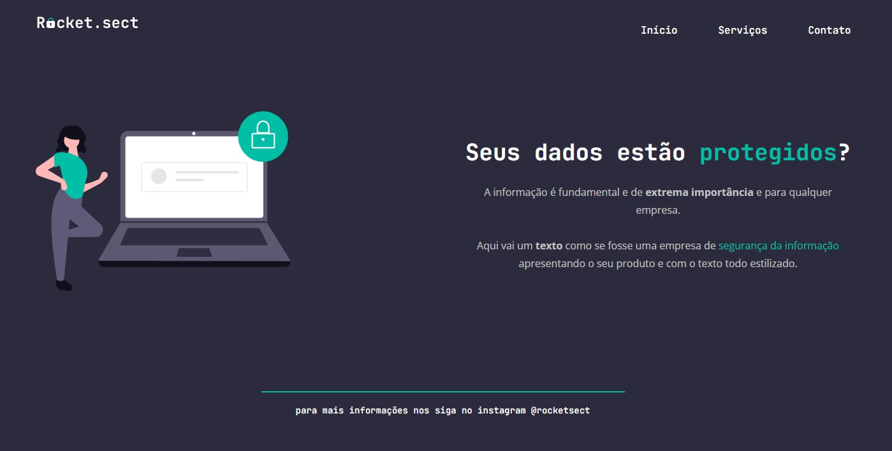

# rocket.sect

<h1 align="center"> Rocket.sect </h1>

O projeto Rocket.sect foi desenvolvido durante o stage 02 no Explorer da Rocketseat. O proejto em questão trata-se de um desafio avançado.  

  

## 🚀 Tecnologias

Esse projeto foi desenvolvido com as seguintes tecnologias:

- HTML e CSS
- Git e Github
- Figma

[Acesse o projeto finalizado, online](https://marcelgava.github.io/rocket.sect/)
